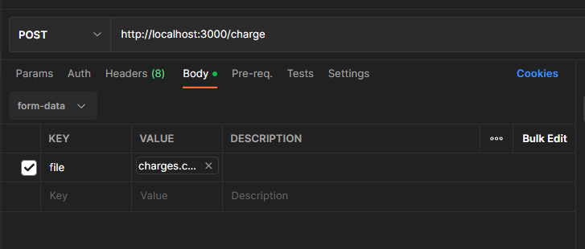

# API de Cobrança

API desenvolvida para realizar cobranças por E-mail.


## Stack utilizada

**Back-end:** Node, Typescript, Express, Prisma ORM,


## Documentação da API

Para facilitar os testes na API, no link abaixo contem um arquivo de exportação no formato JSON, referente a collection do postman com as requisiçoes prontas. E também um arquivo CSV de exemplo para ser ultilizado no body da requisição:
[Google DRIVE - KANASTRA](https://drive.google.com/drive/folders/1Jd-rA715hSr-Z0dokXRxknev7xljepre?usp=sharing)

OBS: Para a requisição POST onde será enviado o arquivo CSV, o body deve ser enviado como "form-data", conforme a imagem de exemplo abaixo:


#### Enviar cobranças: 
```http
  POST /charge
```
| Form-data   | Tipo       | Descrição                                           |
| :---------- | :--------- | :-------------------------------------------------- |
| `file`      | `file`     | **Obrigatório**. Arquivo CSV contendo as cobranças  |


#### Enviar notificação via Webhook: 
```http
  POST /webhook
```
| Campos do JSON  | Tipo     | Descrição                        |
| :----------     | :------- | :------------------------------- |
| `debtId`        | `string` | **Obrigatório**. Identificação do débito          |
| `paidAt`        | `string` | **Obrigatório**. Data de pagamento                |
| `paidAmount`    | `number` | **Obrigatório**. Valor pago                       |
| `paidBy`        | `string` | **Obrigatório**. Nome do pagador                  |


#### Listar todas as cobranças:
Rota GET disponibilizada para listar todas as cobranças que estão salvas no banco de dados.
```http
  GET /charge
```


## Executando a aplicação local com o docker-compose 

1. Baixe o repositório do projeto em seu computador.
2. Acesse o diretório raiz do projeto.
4. Crie uma copia do arquivo ".env.example" e renomeei o mesmo para: ".env".
4. Execute o seguinte comando:
```bash
# realiza o build e já sobe o container
$ docker-compose up --build
```
5. Aplicação ficará disponível na porta 3000, exemplo: http://localhost:3000/charge


**Testes:** Para executar os testes: 
```bash
# executa todos os testes
$ yarn teste
```